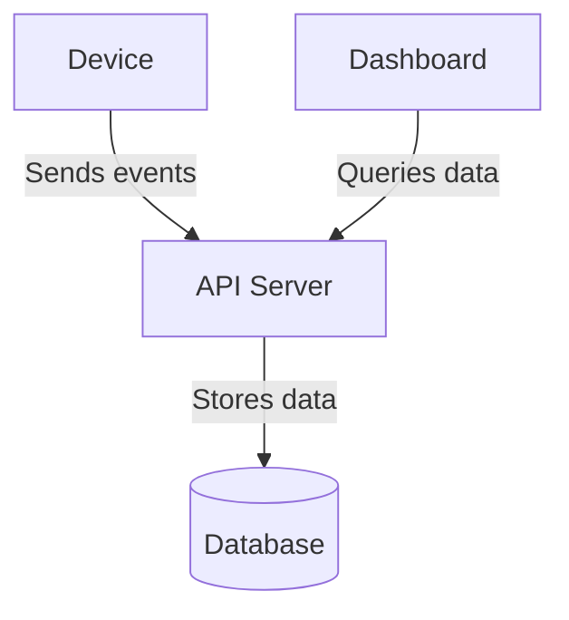
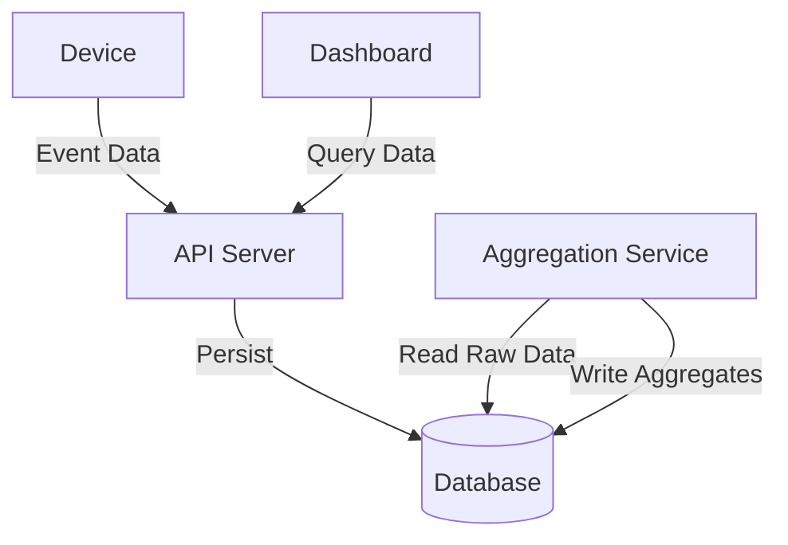
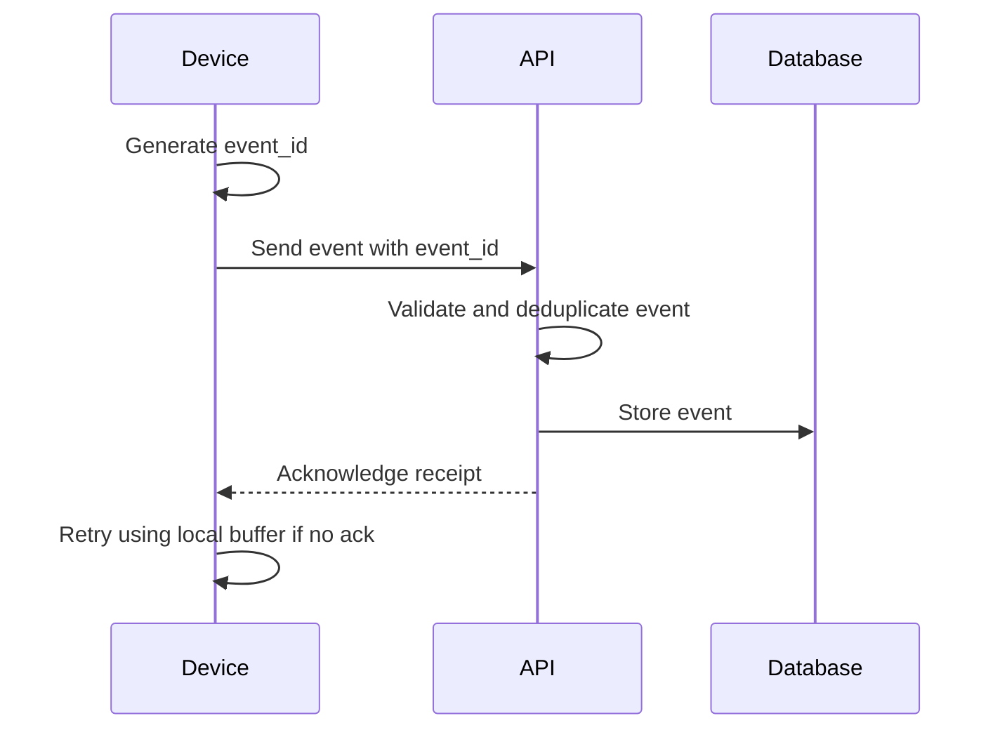
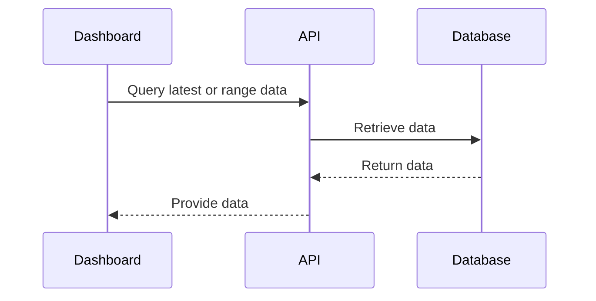
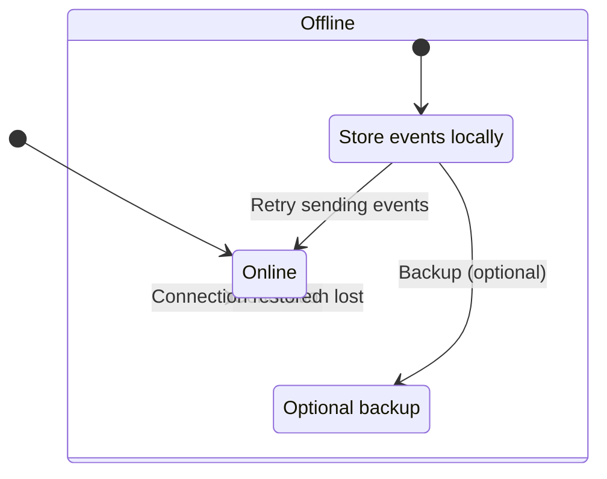
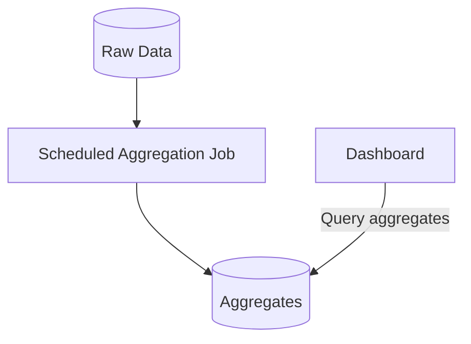
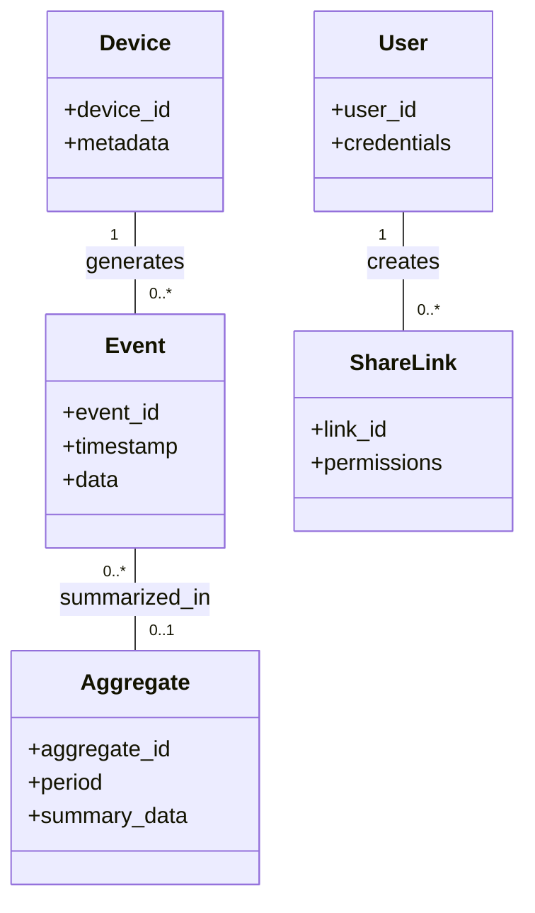

# Diagrams

## Purpose

This document presents a set of diagrams illustrating the architecture and workflows of the WeatherA Station system. The diagrams focus on high-level concepts and interactions, deliberately avoiding vendor-specific implementations and detailed code-level information to maintain clarity and adaptability.

## Table of Contents

- [System Context](#system-context)  
- [Containers / Components](#containers--components)  
- [Sync Ingest Sequence](#sync-ingest-sequence)  
- [Read Flow Sequence](#read-flow-sequence)  
- [Offline / Retry Behavior](#offline--retry-behavior)  
- [Aggregation Overview](#aggregation-overview)  
- [Domain Model](#domain-model)  
- [Security Boundaries](#security-boundaries)  
- [Conventions](#conventions)  

---

## System Context



---

## Containers / Components



---

## Sync Ingest Sequence



---

## Read Flow Sequence



---

## Offline / Retry Behavior



---

## Aggregation Overview



---

## Domain Model



---

## Security Boundaries

```mermaid
flowchart TD
    Device[Device]
    API[API Server]
    Backend[Backend + Database]
    ShareLinks[Read-Only Share Links (Future)]

    Device -.->|Untrusted boundary| API
    API -->|Trusted boundary| Backend
    ShareLinks -.-> Backend
```

---

## Conventions

- **Naming:** Entities and components are named to reflect their roles clearly and consistently across diagrams.  
- **Updates:** Diagrams are maintained to reflect current architecture decisions and planned future enhancements, avoiding implementation specifics.  
- **Abstraction:** Details such as specific technologies, timings, and vendor names are intentionally omitted to preserve vendor neutrality and focus on conceptual clarity.
